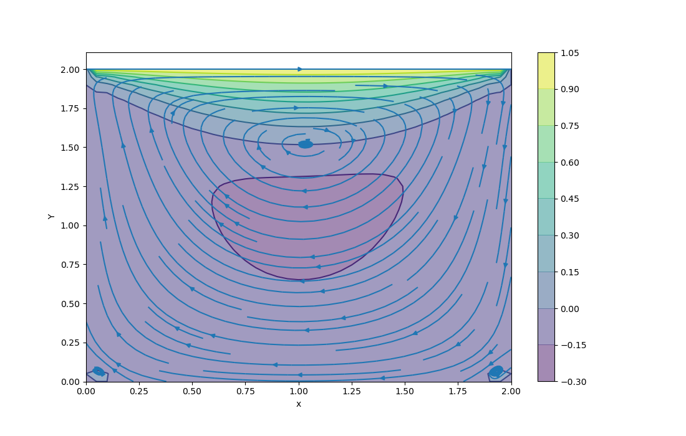
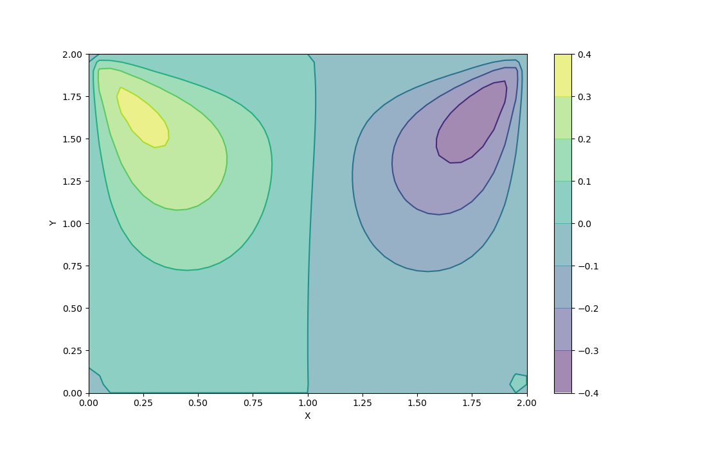
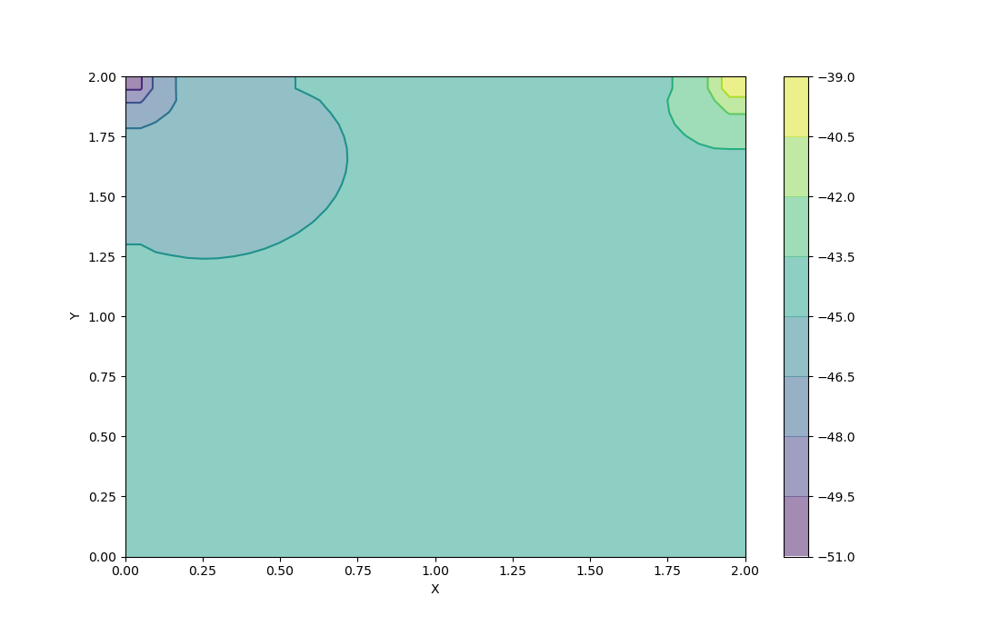

# PHY690Code
Code for course PHY690W High Performance Computing
In physics, the Navier – Stokes equations, named after Claude-Louis Navier and George Gabriel Stokes, describe the motion of fluid substances. These equations arise from applying Newton's second law to fluid motion, together with the assumption that the fluid stress is the sum of a diffusing viscous term (proportional to the gradient of velocity) and a pressure term - hence describing viscous flow. The Pressure – Poisson equation (Poisson equation for pressure) is a derived equation to relate the pressure with momentum equation. It has been derived using the continuity equation as constrain for momentum equation. Adding the partial derivative of x – momentum w.r.t. x and the partial derivative of y – momentum w.r.t. y and then applying the continuity equation yields the Pressure – Poisson equation.

## Usage
Set the initial parameters.

## Parameters
nx:      Number of nodes in the x-direction  
ny:     Number of nodes in the y-direction  
nt:      Number of time steps  
nit:     Number of artificial time steps  
vis:     Viscosity  
rho:     Density  
Lx:      Length in the x-direction  
Ly:      Length in the y-direction  
dx:      Grid spacing in the x-direction  
dy:      Grid spacing in the y-direction  
dt:      Time-step size  
x:       Node x-ordinates  
y:       Node y-ordinates  
u:       Nodal velocity x-component  
v:       Nodal velocoty y-component  
p:       Nodal pressure  
un:      Time marched velocity x-direction  
vn:      Time marched velocity y-direction  
pn:      Temporary pressure for calculations  
b:       Nodal source term value from pressure  

The images below are for the 2-D case. 

### U Velocity 

  

### V Velocity

  

### Pressure Field 

  

